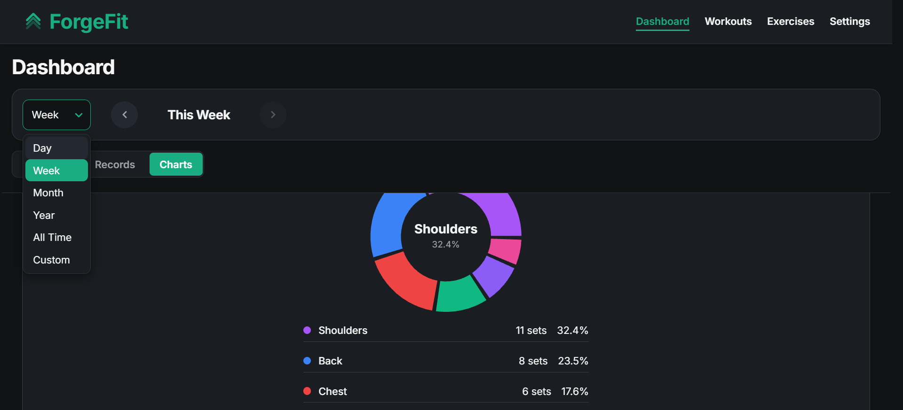
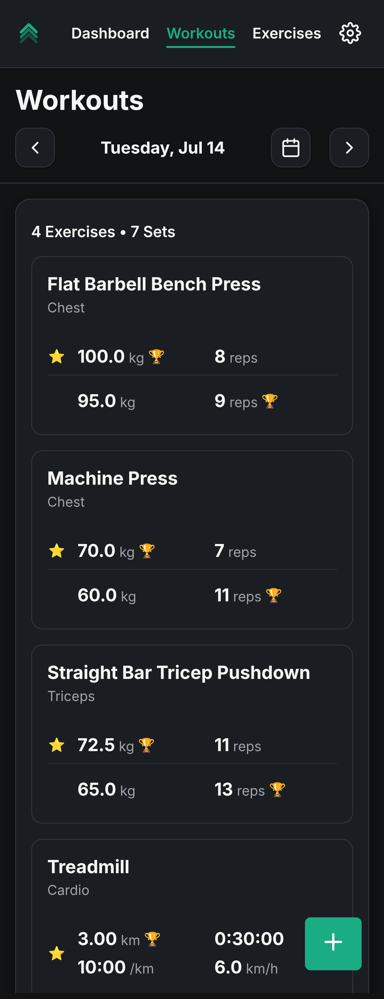
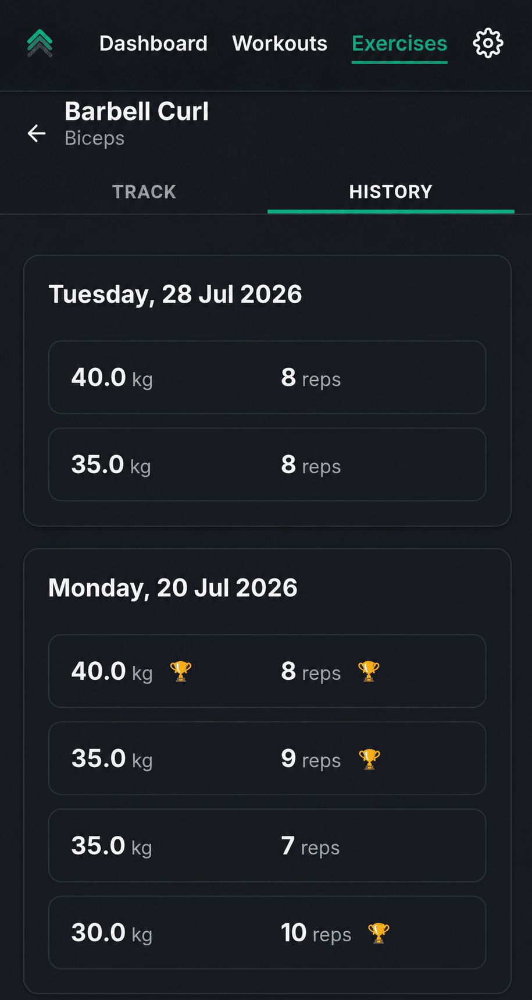

# ForgeFit

A full-stack fitness tracking app for logging workouts, tracking exercises by category, and watching your progress build over time — built to feel like a real product, not a CRUD demo.



## Features

- **Workout logging** — log sets, reps, weight, and other metrics per exercise, organized by day
- **Exercise library** — exercises are grouped into user-defined categories, with stable identities so renaming an exercise preserves its history
- **Progress dashboard** — charts and stats broken down by time period and category
- **Personal records** — automatic PR detection and history per exercise
- **Auth** — email/password (JWT, 30-day sessions) or Google OAuth
- **Responsive, mobile-first UI** — swipe navigation between days/periods, smooth transitions throughout
- **Installable PWA** — add ForgeFit to your home screen and use it like a native app

| | |
|---|---|
|  |  |

## Tech Stack

**Frontend:** React + Vite, React Router, Framer Motion, Recharts, react-swipeable, react-select, react-toastify

**Backend:** Node.js, Express, MongoDB + Mongoose, JWT auth, Google OAuth, express-rate-limit, helmet

## Getting Started

### Prerequisites
- Node.js 18+
- A MongoDB connection string (local or [Atlas](https://www.mongodb.com/cloud/atlas))

### 1. Clone the repo
```bash
git clone https://github.com/Shaurya03/forgefit.git
cd forgefit
```

### 2. Server setup
```bash
cd server
npm install
cp .env.example .env
```
Fill in `.env` with your own values:

| Variable | Description |
|---|---|
| `MONGO_URI` | Your MongoDB connection string |
| `SECRET` | Secret used to sign JWTs |
| `CLIENT_ORIGIN` | URL of the frontend, for CORS (e.g. `http://localhost:5173`) |
| `GOOGLE_CLIENT_ID` | OAuth client ID, if using Google sign-in |
| `PORT` | *(optional)* — defaults to `5000` locally; hosts like Render/Railway set this automatically in production |

Run it:
```bash
npm run dev
```

### 3. Client setup
```bash
cd ../client
npm install
cp .env.example .env
```
Fill in `.env`:

| Variable | Description |
|---|---|
| `VITE_API_BASE_URL` | URL of the running backend (e.g. `http://localhost:5000`) |
| `VITE_GOOGLE_CLIENT_ID` | OAuth client ID, if using Google sign-in |

Run it:
```bash
npm run dev
```

The app will be running at `http://localhost:5173`, proxying API calls to the backend.

## Building for Production

```bash
cd client
npm run build   # outputs to client/dist
npm run preview # serve the production build locally to sanity-check
```

The build includes a generated service worker (via `vite-plugin-pwa`) for offline support and installability.

## Deployment Notes

- **Backend:** deploy `server/` to any Node host (Render, Railway, Fly.io, etc). Run with `npm start`. Set all the env vars listed above — the server reads `process.env.PORT` automatically, so no manual port configuration is needed on the host.
- **Frontend:** deploy `client/` as a static build (`npm run build` → serve `client/dist`) via Vercel, Netlify, or similar. Set `CLIENT_ORIGIN` on the backend to match the deployed frontend URL so CORS allows it.
- Rate limiting on auth routes assumes the app sits behind a reverse proxy — `app.set("trust proxy", 1)` is already configured for this.

## Project Structure

```
forgefit/
├── client/     # React + Vite frontend
└── server/     # Express + MongoDB backend
```

## Architecture Notes

- State management uses React Context + reducers per domain (auth, workouts, exercises, categories, settings)
- Exercises and categories use stable IDs so renaming doesn't break historical workout data
- CORS is locked down via `CLIENT_ORIGIN` env var rather than left open
